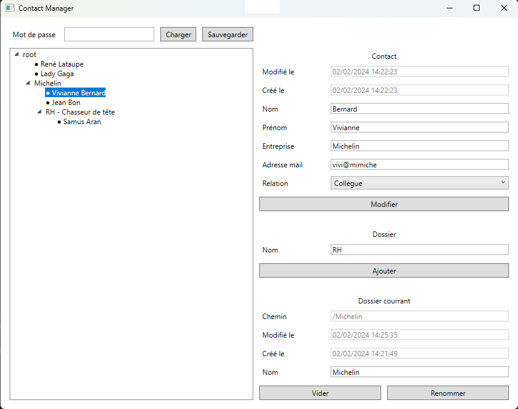

# Contact Manager

## Description

Ce projet a été developpé dans le cadre du cours de developpement C# .NET de ZZ2 à l'ISIMA (Filière F2).
Le but de ce projet est de developper une application de gestion de contacts dans une arborescence : Contact Manager, ici en version console et graphique.

L'implémentation de ce projet se décomposent en 4 sous-projets suivant:

### Serialize

Ce projet implémente et expose une interface simple de sérialisation chiffrée de données, basée sur le design pattern Factory.
Elle propose au choix la sérialisation binaire (dépréciée) ou XML, couplée à du chiffrement symétrique AES, au sein d'une interface commune partagée.

### DataManager

Ce projet implémente et expose les structures de données métiers utilisées dans le cadre de ce projet.
En plus de ces structures de données, nous retrouvons un gestionnaire d'arborescence, encapsulant les fonctionnalités principales (gestion de l'arborescence), incluant la sérialisation des données chiffrées.
La serialisation des données est effectuée sur des Data Storage Objects (DSO), afin de sauvegarder uniquement les données nécessaires à la regénération de l'arborescence et de ses données.

### Contact Manager CLI

Ce projet est l'application principale en version console. La liste des commandes est disponible avec la commande `help`.
Une trace d'exécution est disponible dans [ici](Contact%20Manager%20CLI.pdf)

### Constact Manager UIX

Ce projet est l'application principale en version graphique WPF. Elle possède les mêmes fonctionnalités que la version console, avec l'ergonomie en plus, et est donc compatible avec la version CLI.
Selectionner un dossier pour ajouter des contacts, et un contact pour le modifier. Supprimer un élément sélectionné avec la touche `Suppr.` du clavier.

## Build

- Visual Studio 2022
- .NET Framework 4.8.1

Démarrer, en mode debug ou release, le projet Contact Manager CLI ou Contact Manager UIX.

## Features

- Gestion des dossiers: ajout, suppression, vidage, renommage, navigation, maintient de l'unicité des noms, date de création et de mise à jour,
- Gestion des contacts: ajout, suppression, modification, vérification des champs (champs non vide, email valide, relation valide), date de création et de mise à jour,
- Serialisation à chiffrement symétrique par mot de passe, ou identifiant Windows de sécurité (user-SID) si non spécifié.
- Possibilité de sauvegarder et de recharger n'importe quand durant l'exécution, et suppression de la sauvegarde au delà de 3 erreurs de mot de passe au chargement.
- Gestion des erreurs et messages d'erreurs utilisateur
- CLI: gestion des arguments contenant des espaces en utilisant des guillemets : ~`add folder Mon Dossier`~ -> `add folder "Mon Dossier"`
- CLI: interface colorée
- CLI: navigation entre les dossiers avec norme UNIX & Windows: /root/folder/../folder/./subfolder
- CLI: conception facilement extensible / ajout facile de nouvelles commandes
- UIX: navigation en 1 click
- Documentation totale du code source
- Qualité du code source (encapsulation, conception, réutilisabilité, respect des conventions C#, ...)
